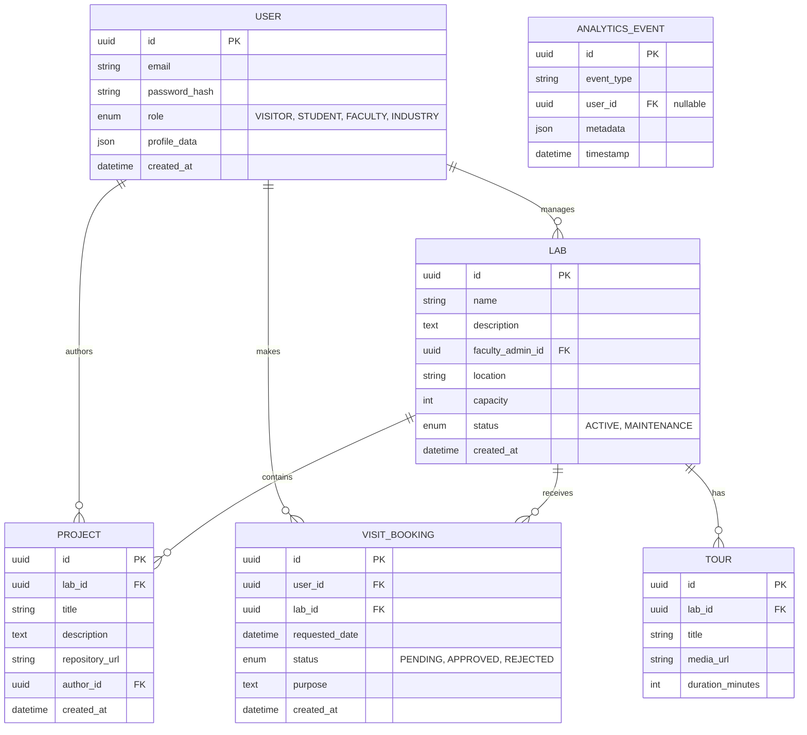

# LabVerse AI: Database Design & Schema

This document details the relational database schema (PostgreSQL) for LabVerse AI. We will use Prisma as the ORM.

## Entity Relationship Diagram (Conceptual)

## Indexes & Performance Considerations

1.  **Users:** Unique index on `email`. Index on `role` for fast filtering.
2.  **Labs:** Index on `faculty_admin_id`.
3.  **Projects:** Index on `lab_id` and `author_id`.
4.  **VisitBookings:** Composite index on `(lab_id, requested_date)` to quickly check schedule conflicts.
5.  **Analytics:** Index on `timestamp` and `event_type` for time-series aggregation.

## Caching Strategy
*   Static Lab Information (Name, Description, Location) will be cached in Redis with a TTL of 1 hour to reduce database load on the public Lab Explorer.
*   Invalidation happens upon updates by the Faculty Admin.
